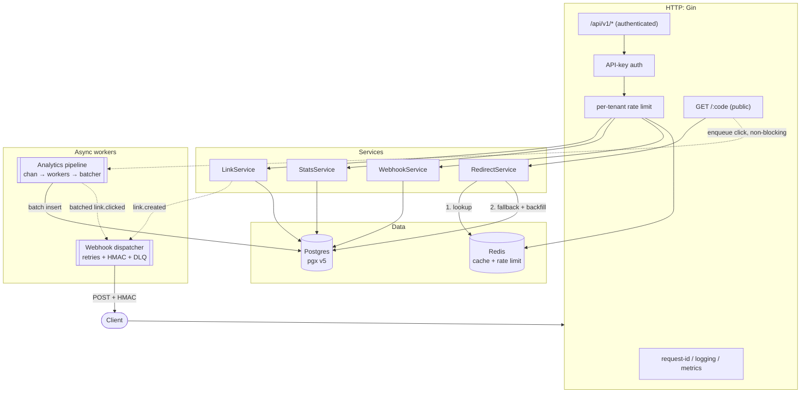

# go-link-shortener

High-performance, multi-tenant URL shortener and click-analytics service in
**Go 1.25+**. Built to demonstrate senior-level Go: concurrency, a low-latency
hot path, clean layered architecture, and full operational maturity.

[](https://github.com/a4anthony/go-link-shortener/actions/workflows/ci.yml)

- **Redirect hot path**: Redis-first lookup with Postgres fallback + cache
  backfill. Measured **p99 ≈ 15 ms at ~34k req/s** locally (target: p99 < 50 ms).
- **Async analytics**: every click flows through a buffered channel → worker
  pool → batched Postgres writes. Analytics **never block a redirect**; a full
  queue drops with a metric.
- **Strict multi-tenancy**: every repository query is tenant-scoped; a test
  proves cross-tenant access is impossible. API keys are hashed at rest.
- **Per-tenant rate limiting** (Redis sliding window, `429` + `Retry-After`).
- **Webhooks** for `link.created` / `link.clicked` with HMAC-SHA256 signatures,
  exponential-backoff-with-jitter retries, and dead-lettering.
- **Observability**: Prometheus metrics, structured `slog` JSON logs with request
  IDs, graceful shutdown that drains in-flight work.

## Architecture

Clean layered architecture — `handler → service → repository` — with services
defining interfaces and repositories implementing them. Dependencies are wired
explicitly in [`cmd/server/main.go`](cmd/server/main.go); no DI framework.



```
cmd/server/main.go        # explicit dependency wiring + lifecycle
internal/
  config/                 # typed env config, validated at startup
  handler/                # Gin handlers, DTOs, validation
  service/                # business logic; defines repository interfaces
  repository/             # pgx + redis implementations
  middleware/             # auth, rate limit, request id, logging, metrics
  analytics/              # click pipeline: channel + worker pool + batcher
  webhook/                # dispatcher, HMAC signer, retry/DLQ
  shortcode/              # base62 generator + alias validation
  metrics/                # Prometheus collectors
  seed/                   # dev demo tenant + API key
migrations/               # golang-migrate SQL (embedded, applied at startup)
scripts/                  # k6 / hey load tests
web/                      # React + TS + Tailwind control console (Vite, nginx)
```

## Quickstart

```bash
docker compose up --build
```

This starts Postgres, Redis, the API (`:8080`), and the **web console** (`:8090`).
In dev mode the server applies migrations, seeds a demo tenant, and prints its
API key:

```
level=WARN msg="demo tenant ready — use this API key to authenticate" api_key=sk_live_demo-seed-key
```

### Web console

A React + TypeScript + Tailwind control console lives in [`web/`](web/) and is
served at **http://localhost:8090** by the compose stack. It manages links,
visualizes per-link click analytics (time series + referrer/country/device
breakdowns), and registers webhooks — all against the same API. It ships
pre-authenticated with the dev key; change it under **Settings**. (Short-link
redirects themselves stay on the API origin, `:8080/<code>`.)

```bash
# run the UI on its own against a running API:
cd web && npm install && npm run dev   # http://localhost:3000, proxies /api to :8080
```

Override the console's host port if 8090 is taken: `WEB_PORT=9000 docker compose up`.

Create and use a link:

```bash
KEY=sk_live_demo-seed-key

# Create
curl -s -X POST localhost:8080/api/v1/links \
  -H "Authorization: Bearer $KEY" -H "Content-Type: application/json" \
  -d '{"url":"https://example.com","custom_alias":"promo"}'

# Redirect (302)
curl -i localhost:8080/promo

# Stats
curl -s "localhost:8080/api/v1/links/<id>/stats?bucket=hour" -H "Authorization: Bearer $KEY"
curl -s localhost:8080/api/v1/stats/overview -H "Authorization: Bearer $KEY"
```

### Local development

```bash
make run              # run the server
make test             # unit tests (race detector)
make test-integration # integration tests (testcontainers: real PG + Redis)
make lint             # golangci-lint (zero errors)
make bench            # redirect hot-path benchmarks
make migrate-up       # apply migrations with the migrate CLI
```

## Deployment

A production compose file runs the whole stack behind a single nginx front
door: the console, the JSON API, and the redirect hot path share one origin,
while Postgres, Redis, and the app (including `/metrics`) stay on the internal
network.

```bash
cp .env.prod.example .env   # set APP_BASE_URL and two generated secrets
make deploy-up              # docker compose -f docker-compose.prod.yml up -d --build
```

The app runs with `APP_ENV=prod` (release logging, `IP_HASH_SALT` required) and
nginx routes by path: `/api/*` and single-segment short codes proxy to the Go
service, console routes serve the SPA, and `/metrics` is refused at the front
door (scrape `app:8080/metrics` on the internal network instead).

### Deploying on Ploi (or any host)

[`scripts/deploy.sh`](scripts/deploy.sh) is the host-agnostic source of truth for
a deploy — Ploi, a manual SSH session, or CI all just invoke it. It resets to the
target branch, rebuilds only changed layers, brings the stack up (the app applies
its embedded migrations on startup once Postgres is healthy — no separate migrate
step), size-caps the Docker build cache, and blocks until every service reports
healthy.

Point the Ploi site's **Deploy Script** at it:

```bash
cd /home/ploi/links.a4anthony.com
DEPLOY_BRANCH=main bash scripts/deploy.sh
```

`.env` is gitignored, so create it once on the server (`cp .env.prod.example .env`
and fill in the secrets) — the deploy's `git reset --hard` leaves it untouched.
Knobs: `DEPLOY_PULL=0` deploys the current tree without fetching, `DEPLOY_BRANCH`
pins the branch, `ENV_FILE` / `COMPOSE_FILE` override the defaults.

### The demo playground

By default the deployed instance is a **keyless playground**: the server seeds
a shared demo tenant whose well-known key (`sk_live_demo-seed-key`) is also the
console's default, so visitors can create links and browse analytics without
signing up. Multi-tenant auth stays fully enforced underneath — the playground
is simply one seeded tenant that everybody shares.

Guardrails keep the shared tenant bounded:

| Env var | Prod default | Effect |
|---|---|---|
| `SEED_DEMO_TENANT` | `true` | seed the playground tenant outside dev mode |
| `DEMO_MAX_LINK_TTL` | `24h` | demo links are clamped to this lifetime; clearing an expiry re-applies the cap |
| `DEMO_RETENTION` | `24h` | grace before expired/deleted demo links are hard-deleted (their clicks cascade) |
| `DEMO_CLEANUP_INTERVAL` | `1h` | janitor sweep cadence |
| `RATE_LIMIT_REQUESTS` | `60` per `1m` | per-tenant API rate limit |

For a private deployment set `SEED_DEMO_TENANT=false`; there is deliberately no
public signup endpoint, so provision tenants with two inserts (the stored key
hash is plain SHA-256 hex):

```sql
INSERT INTO tenants (name) VALUES ('acme') RETURNING id;
INSERT INTO api_keys (tenant_id, name, prefix, key_hash)
VALUES ('<tenant-id>', 'default',
        left('sk_live_your-long-random-key', 16),
        encode(sha256('sk_live_your-long-random-key'), 'hex'));
```

## API reference

All `/api/v1/*` routes require `Authorization: Bearer <api_key>`. Errors use a
consistent envelope: `{"error": {"code": "...", "message": "..."}}`.

| Method | Path                         | Description                                        |
| ------ | ---------------------------- | -------------------------------------------------- |
| POST   | `/api/v1/links`              | Create a link (auto code or `custom_alias`)        |
| GET    | `/api/v1/links`              | List links (`?limit=&offset=`)                     |
| GET    | `/api/v1/links/:id`          | Get a link                                         |
| PATCH  | `/api/v1/links/:id`          | Update a link (partial; `null` clears a field)     |
| DELETE | `/api/v1/links/:id`          | Soft-delete a link                                 |
| GET    | `/api/v1/links/:id/stats`    | Link analytics (`?from=&to=&bucket=hour\|day`)     |
| GET    | `/api/v1/stats/overview`     | Tenant-wide totals and busiest links               |
| POST   | `/api/v1/webhooks`           | Register a webhook (returns the signing secret once) |
| GET    | `/api/v1/webhooks`           | List webhooks                                      |
| DELETE | `/api/v1/webhooks/:id`       | Delete a webhook                                   |
| GET    | `/:code`                     | **Public** redirect (301/302); 410 if expired/exhausted |
| GET    | `/healthz` `/readyz`         | Liveness / readiness probes                        |
| GET    | `/metrics`                   | Prometheus metrics                                 |

Create-link body: `{"url", "custom_alias"?, "redirect_type"? (301|302),
"expires_at"? (RFC3339), "max_clicks"?}`. Expired or click-exhausted links
return **410 Gone**.

## Benchmarks

Redirect hot path, measured locally (Apple M5, Go 1.25, Postgres 16 + Redis 7 in
Docker; `RATE_LIMIT_ENABLED=false`, `LOG_LEVEL=warn`):

**End-to-end (`hey`, cache-hit path, 100k requests @ 200 concurrency):**

| Metric | Value       |
| ------ | ----------- |
| Throughput | ~34,000 req/s |
| p50    | 5.7 ms      |
| p90    | 7.3 ms      |
| p95    | 8.3 ms      |
| p99    | 14.9 ms     |

Comfortably under the spec's **p99 < 50 ms** target. Reproduce with
[`scripts/loadtest.sh`](scripts/loadtest.sh) or `k6 run scripts/loadtest.js`.

**Service-layer micro-benchmark (`go test -bench`, no I/O):**

```
BenchmarkResolve_CacheHit-10     ~30 ns/op    0 B/op   0 allocs/op
BenchmarkResolve_CacheMiss-10    ~33 ns/op    0 B/op   0 allocs/op
```

## Design decisions

See [docs/DESIGN.md](docs/DESIGN.md) for the full rationale. In brief:

- **Cache strategy.** The redirect path reads Redis first and falls back to
  Postgres, backfilling the cache. Missing codes are negatively cached to blunt
  cache-penetration from bogus codes. Mutations (update/delete) and click
  exhaustion invalidate the entry, so stale targets are never served. A cache or
  Redis error **fails open** to Postgres rather than erroring the redirect.
- **Analytics batching.** Per-click `INSERT`s would make the hot path pay a
  synchronous DB write. Instead clicks go through a buffered channel drained by a
  worker pool that flushes on size **or** time into a single `COPY`. When the
  buffer is full, clicks are **dropped with a metric** — the redirect is never
  back-pressured.
- **Tenancy isolation.** Every repository method takes a `tenant_id` and includes
  it in the `WHERE` clause; a resource in another tenant is indistinguishable
  from a missing one. The only non-scoped read is the public redirect lookup by
  globally-unique code. An integration test proves cross-tenant reads, updates,
  and deletes are impossible.

## License

[MIT](LICENSE)
